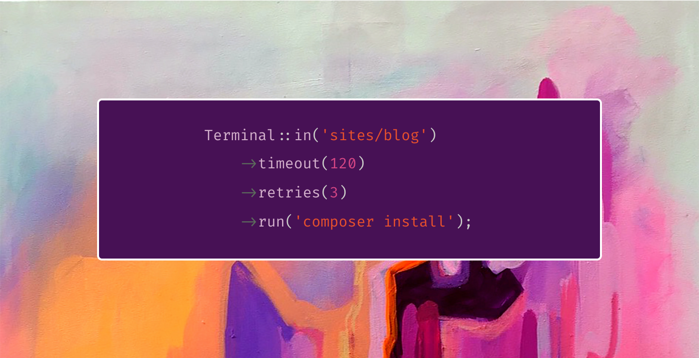

I stand with Ukraine | 🇺🇦
:---: | :---

# Terminal

An Elegant wrapper around Symfony's Process component.



---

# Content

- [Installation](#installation)
- [Executing Commands](#executing-commands)
- [Response](#response)
    - [Overview](#response)
    - [Output to Array](#output-to-array)
    - [Output Stream (Recommended)](#output-stream)
    - [Output Lines](#output-lines)
    - [Output via Laravel Artisan Command](#output-via-laravel-artisan-command)
    - [Output via Symfony Console Command](#output-via-symfony-console-command)
    - [Throwing Exceptions](#throwing-exceptions)
- [Data](#data)
- [Working Directory](#working-directory)
- [Timeout](#timeout)
- [Retries](#retries)
- [Environment Variables](#environment-variables)
- [Command](#command)
- [Symfony Process](#symfony-process)
- [Testing](#testing)
    - [Overview](#testing)
    - [Faking Responses](#faking-responses)
    - [Faking Specific Commands](#faking-specific-commands)
    - [Response Lines](#response-lines)
    - [Failed Response](#failed-response)
    - [Inspecting Commands](#inspecting-commands)
    - [Mocking Symfony Process](#mocking-symfony-process)
    - [Caveats](#caveats)
- [PHP 8 Support](#php-8-support)

<!-- - [Executing Command Asynchronously](#executing-commands-asynchronously) -->

# Installation

```composer require titasgailius/terminal```

# Executing Commands

To execute a command, you may use the `run` method. First, let's examine how to execute a basic shell command.

```php
$response = Terminal::run('rm -rf vendor');
```

# Response

The `run` method returns an instance of `TitasGailius\Terminal\Response`, which provides a variety of methods that may be used to inspect the response:
```php
$response->getExitCode() : int;
$response->ok() : bool;
$response->successful() : bool;

$response->lines() : array;
$response->output() : string;
(string) $response: string;
```

### Output to Array

You may get the entire command output on a single array by using  `lines` method:

```php
foreach ($response->lines() as $line) {
    //
}
```

### Output Stream (Recommended)

If memory consumption is important, you may read the entire output line by line, using a `foreach` loop on the response instance:


```php
foreach ($response as $line) {
    //
}
```

### Output Lines

Every `$line` item is an instance of `TitasGailius\Terminal\OutputLine` object,
which provides a variety of methods that may be used to inspect the output line.

You may inspect if the output line is an error:

```php
$line->error(); // true|false
```

And you may use this object as a string to get the contents of the line:

```php
(string) $line;
```

Alternatively, you may use the `content` method to get the contents of the line:

```php
$line->content();
```

### Output via Laravel Artisan Command

If you run Terminal from the Laravel's Artisan command, you may send the output to the console by
passing an instance of the Command to the `output` method:

```php
public function handle()
{
    Terminal::output($this)->run('echo Hello, World');
}
```

### Output via Symfony Console Command

If you run Terminal from the Symfony's Console command, you may send the output to the console by
passing an instance of the OutputInterface to the `output` method:

```php
protected function execute(InputInterface $input, OutputInterface $output)
{
    Terminal::output($output)->run('echo Hello, World');
}
```

### Throwing Exceptions

If you would like to throw an exception when the command is not successful, you may use the `throw` method:

```php
$response = Terminal::run(...);

$response->throw();

return (string) $response;
```

An instance of `Symfony\Component\Process\Exception\ProcessFailedException` will be thrown on error.

<!-- # Executing Commands Asynchronously

To execute a command asynchronously, you may use the `executeInBackground` or `inBackground` methods.
Keep in mind that it's a good practice to "wait" for the command to finish at the end of your code execution.


```php
Terminal::runInBackground('rm -rf vendor');
Terminal::inBackground()->run('rm -rf node_modules');

// Do some other stuff...

Terminal::wait();
```

If you want to know why it's better to wait for the command to complete, you may read these [Symfony notes](https://symfony.com/doc/current/components/process.html#running-processes-asynchronously).
 -->
# Data

If you need to pass any data to your command line, it's better to bind it using the `with` method.
Terminal can escape and prepare the values for you. Reference these values using the `{{ $key }}` syntax.

```php
Terminal::with([
    'firstname' => 'John',
    'lastname' => 'Doe',
])->run('echo Hello, {{ $firstname}} {{ $lastname }}');
```

Alternatively, you may pass the key-value pair in separate parameters.

```php
Terminal::with('greeting', 'World')
        ->run('echo Hello, {{ $greeting }}');
```

# Working Directory

If you would like to change the current working directory from which
the script is executed, you may use the `in` method that accepts a path:

```php
Terminal::in(storage_path('framework'))->run('rm -rf views');
```

# Timeout

If you would like to add a timeout to your command, you may use the `timeout` method that accepts an integer in seconds or an instance of DateTime, DateInterval and Carbon:

```php
Terminal::timeout(25)->run('rm -rf vendor');
```

Using `DateInterval`:

```php
$duration = new DateInterval('PT25S');

Terminal::timeout($duration)->run('rm -rf vendor');
```

Using `DateTime`:

```php
$date = (new DateTime)->add(new DateInterval('PT25S'));

Terminal::timeout($date)->run('rm -rf vendor');
```

Using `Carbon`:

```php
$date = Carbon::now()->addSeconds(25);

Terminal::timeout($date)->run('rm -rf vendor');
```

# Retries

If you would like to automatically retry a command when an error occurs, you may use the `retries` method.
The `retries` method accepts two arguments: the number of times the command should be attempted
and the number of milliseconds that should wait in between attempts:

```php
Terminal::retries(3, 100)->run('rm -rf vendor');
```

# Environment Variables

By default, the shell script is run with the same environment variables as the current PHP process.
If you would like to run a script with a different set of environment variables, you may use the `withEnvironmentVariables` method.
The `withEnvironmentVariables` method accepts an array with key-value pairs of the environment variables.

```php
Terminal::withEnvironmentVariables([
    'APP_ENV' => 'testing',
])->run('rm -rf $DIRECTORY');
```

# Command

In some situations, you might want to use the `command` method to define the executable command before actually executing it.

```php
$command = Terminal::command('rm -rf vendor');

if ($inBackground) {
    $command->inBackground();
}

$command->run();
```

# Symfony Process

You may get an underlying instance of `Symfony\Component\Process\Process` class by calling `process` method.

```php
$process = Terminal::timeout(25)->process();
```

You may also get the process instance from the `TitasGailius\Terminal\Response` object.

```php
$response = Terminal::run(...);

$process = $response->process();
```

Lastly, all missing method calls to the `TitasGailius\Terminal\Response` instance are passed to the underlying process instance automatically.

```php
$response = Terminal::run(...);

$response->isRunning(); // "isRunning" method is passed to the \Symfony\Component\Process\Process class
```

# Extending

The `extend` method allows you to define custom methods.

```php
Terminal::extend('removeVendors', function ($terminal) {
  return $terminal->run('rm -rf vendors');
});

Terminal::removeVendors();
```

# Testing

Terminal has some special features to help you easily and expressively write tests.
Terminal's fake method allows you to instruct the Terminal to return stubbed / dummy response when commands are executed.

### Faking Responses

To instruct the Terminal to return empty responses for every executed command, you may call the `fake` method with no arguments:

```php
Terminal::fake();

$response = Terminal::run(...);
```

### Faking Specific Commands

Alternatively, you may pass an array to the fake method.
The array's keys should represent the commands that you wish to fake and their associated responses.
```php
Terminal::fake([
    'php artisan inspire' => 'Simplicity is the ultimate sophistication. - Leonardo da Vinci',

    'cowsay Hi, How are you' => [
        ' _________________             ',
        '< Hi, How are you >            ',
        ' -----------------             ',
        '        \   ^__^               ',
        '         \  (oo)\_______       ',
        '            (__)\       )\/\   ',
        '                ||----w |      ',
        '                ||     ||      ',
    ],
]);
```

### Response Lines

Besides passing a string or an array of lines, you may explicitly specify the type of each line.
Terminal has `line` and `error` methods that help you create more accurate responses.

```php
Terminal::fake([
    'wp cli update' => [
        Terminal::line('Downloading WordPress files.'),
        Terminal::error('WordPress is down.'),
    ],
]);
```

### Failed Response

It is very simple to stub a failed response.
Move your response line(s) to the Terminal's `response` method and call `shouldFail` on top of that.

```php
Terminal::fake([
    'php artisan migrate' => Terminal::response([
        'Migrating: 2012_12_12_000000_create_users_table',
        'Migrated: 2012_12_12_000000_create_users_table',
    ])->shouldFail(),
]);
```

### Inspecting Commands

When faking responses, you may occasionally wish to inspect the commands the Terminal receives in order to make sure your application is executing the correct commmands.

You may accomplish this by calling the `Terminal::assertExecuted` method after calling `Terminal::fake`.

```php
Terminal::fake();

Terminal::run('php artisan migrate');

Terminal::assertExecuted('php artisan migrate');
```

Alternatively you can also check that a given command was not executed. You may accomplish this by calling the `Terminal::assertNotExecuted` method after calling `Terminal::fake`.

```php
Terminal::fake();

Terminal::assertNotExecuted('php artisan migrate');
```

### Mocking Symfony Process

If you need to mock the underlying Symfony's Process, you may use the Terminal's `response` method.

Terminal's `response` method may be used in several ways:

1. Passing response line(s) and an optional process instance.
2. Passing only the process instance.

```php
$process = Mockery::mock(Process::class, function ($mock) {
    $mock->shouldReceive('getPid')
        ->twice()
        ->andReturn(123, 321);
});

Terminal::fake([
    // Empty response with a mocked \Symfony\Component\Process\Process instance.
    'factor 12' => Terminal::response($process)

    // Response lines with a mocked \Symfony\Component\Process\Process instance.
    'php artisan migrate' => Terminal::response([
        'Migrating: 2012_12_12_000000_create_users_table',
        'Migrated: 2012_12_12_000000_create_users_table',
    ], $process),
]);

$this->assertEquals(123, Terminal::run('factor 12')->getPid());
$this->assertEquals(321, Terminal::run('php artisan migrate')->getPid());
```

### Caveats

Terminal is using some static methods to provide these beautiful testing features.
Specifically, Terminal stores the fake responses on a static property, which means they do not get cleared between each test.

To prevent this you may use the `Terminal::reset` method.
The best place to call it is from the PhpUnit's `teardown` method.

```php
/**
 * This method is called after each test.
 */
protected function tearDown(): void
{
    parent::tearDown();

    Terminal::reset();
}
```

## PHP 8 Support

To use Terminal with PHP 8.x, please upgrade Terminal to the `^1.0` version.

1. Update your `composer.json` to use the latest version of the terminal: `"titasgailius/terminal": "^1.0"`.
2. Note that the `Builder::retry` is now a `protected` method. <br> *It's very unlikely that you were was using this method.*.
